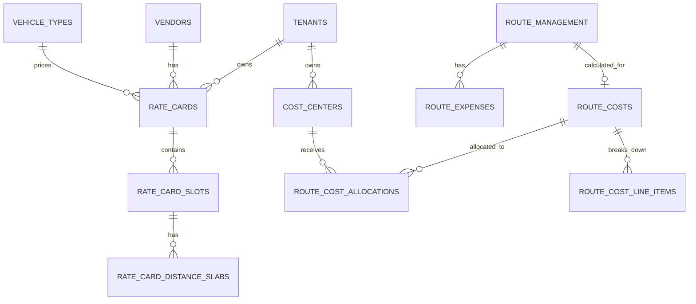
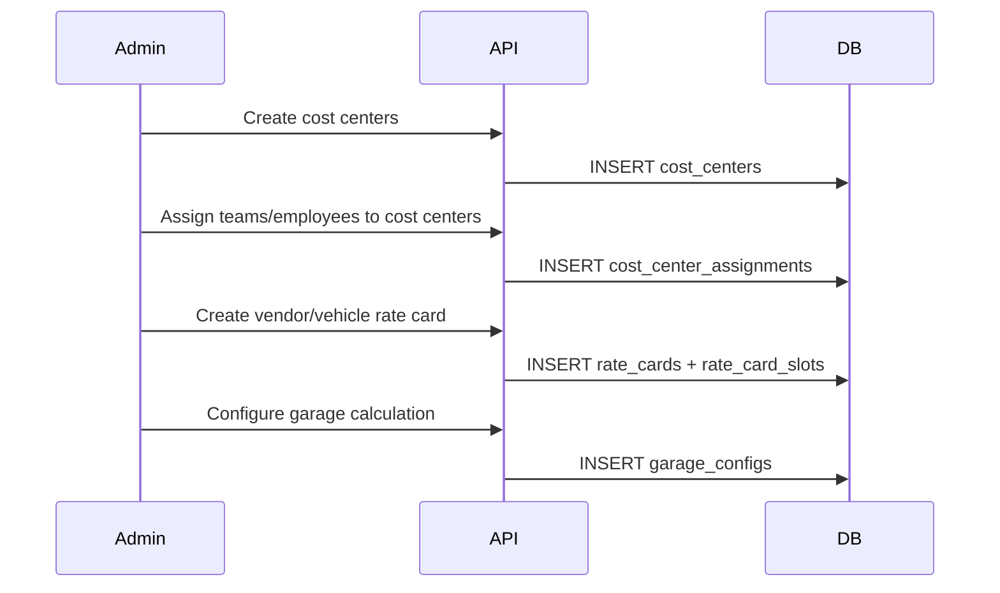
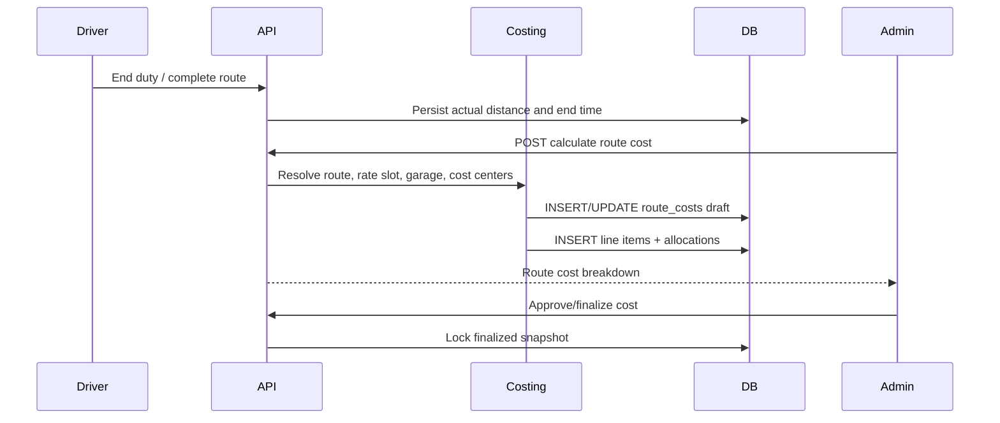
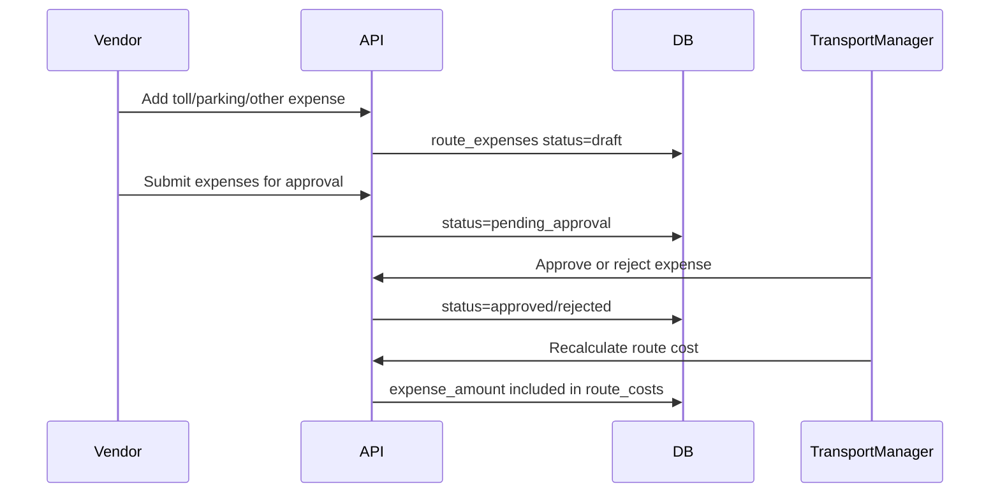

# Cost Center And Route Costing Design

Status: Approved for implementation. Initial backend scope is implemented in this branch.

## 1. Goal

Build a cost center and route costing module for the Fleet Manager backend.

The module should:

- Maintain tenant-level cost centers.
- Assign employees, teams, bookings, and route costs to cost centers.
- Calculate cost per completed route using distance, duration, garage, waiting, escort, and expense components.
- Support calculation slots/slabs by vendor, vehicle type, shift time, day/night window, and effective date.
- Preserve calculation snapshots so finalized invoices do not change when rate cards are edited later.
- Provide APIs and reports for transport admins, vendors, and finance users.

## 2. External Reference Summary

Public MoveInSync help-center material does not expose a direct "cost center" article. The design below uses the related billing and trip-costing concepts available publicly.

Relevant concepts found:

- KM types:
  - Planned KM: route distance estimated during planning/routing.
  - Reference KM: map-provider route calculated at trip end using final waypoints. No-show inclusion is configurable.
  - Actual KM: GPS/device distance actually traveled. GPS loss can make this unavailable.
  - Map KM: real-time fastest map distance from route waypoints.
- Planned vs Actual KM:
  - Planned KM is used for fare forecast, billing forecast, payout estimation, SLA and fuel planning.
  - Actual KM is used for final billing, reimbursement, deviation tracking, and fraud detection.
  - Variance percentage = `((actual_km - planned_km) / planned_km) * 100`.
- Garage KM billing flavors:
  - Vendor garage geocode: use vendor garage coordinates to first pickup and final drop back to garage.
  - Fixed garage KM: use agreed fixed values regardless of actual movement.
  - ETS trip empty leg: use GPS/map distance from actual empty-leg movement.
  - Cab registration garage geocode: use the registered cab garage location.
- Billing workflow:
  - Vendor manager/driver can upload trip expenses after completion.
  - Transport manager/site admin reviews, approves, rejects, or confirms review.
  - Final confirmation should lock edits.
- Raw invoice data concepts:
  - `tripKm`, `tripHr`, `garageToPickupKm`, `dropToGarageKm`, `garageHr`, `waitingTime`, `escortFareApplicable`, `numberOfDays`, and optional daily/leg breakdown.

## 3. Current Project Fit

Existing useful backend pieces:

- `route_management` already stores `assigned_vendor_id`, `assigned_vehicle_id`, `assigned_driver_id`, `shift_id`, `estimated_total_distance`, `estimated_total_time`, `actual_total_distance`, `actual_total_time`, `actual_start_time`, and `actual_end_time`.
- `route_management_bookings` stores route stops, booking order, estimated pickup/drop time, and estimated/actual stop distance.
- `distance_service.compute_and_persist_actual_distance` already calculates GPS-based `actual_total_distance` when duty ends.
- Existing master data includes tenants, teams, employees, vendors, vehicle types, vehicles, shifts, bookings, and reports.
- Route lifecycle already goes from route creation to vendor assignment, vehicle/driver assignment, dispatch, ongoing, and completed.

Recommended integration point:

- Cost calculation should attach to `route_management.route_id` after route completion.
- Cost center allocation should snapshot on the booking/route cost, not dynamically read current employee/team values during reports.

## 4. Main Concepts

### 4.1 Cost Center

A cost center is a tenant-owned accounting unit used to allocate transport spend.

Examples:

- `ENG-BLR`: Engineering Bangalore
- `OPS-NIGHT`: Operations Night Shift
- `FINANCE`: Finance Department

Recommended assignment hierarchy:

1. Booking-level override, if provided.
2. Employee-level cost center assignment.
3. Team-level cost center assignment.
4. Tenant default cost center.
5. `UNALLOCATED`, if none exists.

Reason: teams already exist in the project, but employee overrides are needed when one team has people charged to different internal budgets.

### 4.2 Rate Card

A rate card stores the commercial agreement used for costing.

Recommended dimensions:

- Tenant
- Vendor
- Vehicle type
- Effective date range
- Shift type: `IN`, `OUT`, or `ANY`
- Time/day slot
- Status: draft, active, expired, archived

### 4.3 Calculation Slot

A calculation slot is a time/date/rule window inside a rate card.

Examples:

| Slot | Match | Example Rule |
|------|-------|--------------|
| Day slot | `06:00-21:59` | Base KM slab and extra KM rate |
| Night slot | `22:00-05:59` | Higher base fare or night allowance |
| Weekend slot | Saturday/Sunday | Optional multiplier or separate rate |
| Holiday slot | configured dates | Optional holiday allowance |
| Vehicle slot | Sedan/SUV/TT | Different package and per-KM rate |

Slot precedence:

1. Exact vendor + vehicle type + holiday slot.
2. Exact vendor + vehicle type + weekend/day/night slot.
3. Exact vendor + any vehicle type.
4. Tenant default rate card.
5. Reject calculation with `RATE_SLOT_NOT_FOUND`.

Overlapping active slots for the same vendor, vehicle type, day type, and time window should be blocked.

### 4.4 Distance KM Slab

A distance slab is a named bracket nested inside a slot. Slabs enable per-KM pricing that varies by trip distance, without a fixed base package.

Examples:

| Slab name | `min_km` | `max_km` | `buffer_km` | `rate_per_km` |
|-----------|----------|----------|-------------|---------------|
| 0-15 KM   | 0        | 15       | 1           | ₹25           |
| 16-30 KM  | 16       | 30       | 1           | ₹20           |
| 31-50 KM  | 31       | 50       | 2           | ₹15           |

Slab selection rule: find the first active slab where `slab.min_km ≤ trip_km ≤ (slab.max_km + slab.buffer_km)`. Billing is `trip_km × rate_per_km` for that bracket (not cumulative layers).

`buffer_km` absorbs small GPS/rounding overruns. A slab with `max_km=30, buffer_km=1` accepts a `trip_km` of 31 without falling through to the next bracket.

Slot mode detection: if a slot has at least one active distance slab it operates in slab mode; zero active slabs means legacy base-package mode.

## 5. Proposed Data Model



### 5.1 `cost_centers`

| Column | Type | Notes |
|--------|------|-------|
| `cost_center_id` | int PK | Autoincrement |
| `tenant_id` | string FK | Required |
| `code` | string | Unique per tenant |
| `name` | string | Required |
| `description` | text | Optional |
| `is_default` | bool | One default per tenant |
| `is_active` | bool | Soft deactivate |
| `created_at`, `updated_at` | datetime | Audit fields |

### 5.2 `cost_center_assignments`

| Column | Type | Notes |
|--------|------|-------|
| `assignment_id` | int PK | Autoincrement |
| `tenant_id` | string FK | Required |
| `cost_center_id` | int FK | Required |
| `scope_type` | string | `employee`, `team`, or `tenant` |
| `scope_id` | int/string | Employee ID, team ID, or tenant ID |
| `effective_from` | date | Required |
| `effective_to` | date | Nullable |
| `is_active` | bool | Soft deactivate |

Validation:

- Prevent overlapping active assignments for the same `scope_type`, `scope_id`, and effective date range.
- Employee/team assignments must belong to the same tenant.

### 5.3 Booking Snapshot Change

Add to `bookings`:

| Column | Type | Notes |
|--------|------|-------|
| `cost_center_id` | int FK nullable | Snapshot resolved at booking creation or route costing time |

This protects old bookings from later employee/team cost center changes.

### 5.4 `rate_cards`

| Column | Type | Notes |
|--------|------|-------|
| `rate_card_id` | int PK | Autoincrement |
| `tenant_id` | string FK | Required |
| `vendor_id` | int FK nullable | Null means tenant default |
| `vehicle_type_id` | int FK nullable | Null means any vehicle type |
| `name` | string | Required |
| `currency` | string | Default `INR` |
| `effective_from` | date | Required |
| `effective_to` | date | Nullable |
| `status` | enum | `draft`, `active`, `expired`, `archived` |
| `created_at`, `updated_at` | datetime | Audit fields |

### 5.5 `rate_card_slots`

| Column | Type | Notes |
|--------|------|-------|
| `slot_id` | int PK | Autoincrement |
| `rate_card_id` | int FK | Required |
| `name` | string | `Day`, `Night`, `Weekend`, etc. |
| `shift_log_type` | enum | `IN`, `OUT`, `ANY` |
| `day_type` | enum | `weekday`, `weekend`, `holiday`, `any` |
| `start_time` | time | Nullable for all-day |
| `end_time` | time | Nullable for all-day |
| `base_amount` | numeric | Fixed/package amount (legacy mode) |
| `base_km` | numeric | Included KM (legacy mode) |
| `base_hours` | numeric | Ignored in current KM-only implementation |
| `extra_km_rate` | numeric | Per extra KM (legacy mode); also used for garage KM when `apply_same_km_rate=true` |
| `extra_hour_rate` | numeric | Ignored in current KM-only implementation |
| `waiting_rate_per_hour` | numeric | Reserved, ignored in current KM-only implementation |
| `escort_rate` | numeric | Optional |
| `night_allowance` | numeric | Optional |
| `tax_percent` | numeric | Optional |
| `priority` | int | Higher wins when multiple slots match |
| `is_active` | bool | Required |

A slot with ≥1 active `rate_card_distance_slabs` rows operates in **slab mode**. A slot with zero active slabs operates in **legacy base-package mode**.

### 5.6 `garage_configs`

Can be included in rate cards later, but a separate table keeps the model cleaner.

| Column | Type | Notes |
|--------|------|-------|
| `garage_config_id` | int PK | Autoincrement |
| `tenant_id` | string FK | Required |
| `vendor_id` | int FK nullable | Vendor-specific config |
| `vehicle_id` | int FK nullable | Cab-specific config |
| `method` | enum | `vendor_geocode`, `fixed`, `empty_leg`, `cab_geocode`, `none` |
| `garage_latitude`, `garage_longitude` | numeric | For geocode methods |
| `fixed_start_km`, `fixed_end_km` | numeric | For fixed KM |
| `fixed_start_hours`, `fixed_end_hours` | numeric | Reserved, ignored in current KM-only implementation |
| `apply_same_km_rate` | bool | Whether garage KM uses extra KM rate |
| `apply_same_hour_rate` | bool | Reserved, ignored in current KM-only implementation |
| `is_active` | bool | Required |

### 5.7 `route_costs`

| Column | Type | Notes |
|--------|------|-------|
| `route_cost_id` | int PK | Autoincrement |
| `route_id` | int FK unique | One active cost record per route |
| `tenant_id` | string FK | Required |
| `vendor_id` | int FK | Snapshot |
| `vehicle_id` | int FK | Snapshot |
| `vehicle_type_id` | int FK | Snapshot |
| `rate_card_id` | int FK | Snapshot |
| `slot_id` | int FK | Snapshot |
| `status` | enum | `draft`, `submitted`, `approved`, `rejected`, `finalized` |
| `distance_source` | enum | `actual`, `reference`, `planned`, `manual` |
| `trip_km` | numeric | Used for billing |
| `trip_hours` | numeric | Always `0` in current KM-only implementation |
| `garage_km` | numeric | Start + end garage KM |
| `garage_hours` | numeric | Always `0` in current KM-only implementation |
| `base_amount` | numeric | Base package/fare |
| `extra_km_amount` | numeric | Extra KM charge |
| `extra_hour_amount` | numeric | Always `0` in current KM-only implementation |
| `garage_amount` | numeric | Garage charge |
| `waiting_amount` | numeric | Waiting charge |
| `escort_amount` | numeric | Escort/marshal charge |
| `expense_amount` | numeric | Approved expenses |
| `tax_amount` | numeric | Tax |
| `total_amount` | numeric | Final route cost |
| `variance_percent` | numeric | Actual vs planned variance |
| `calculation_snapshot` | json | Full immutable formula input/output |
| `calculated_at`, `approved_at`, `finalized_at` | datetime | Lifecycle timestamps |

### 5.8 `route_cost_line_items`

Stores itemized charges for UI and invoice explainability.

Examples:

- `BASE_PACKAGE` — fixed package charge (legacy base-package mode)
- `KM_SLAB` — per-KM bracket charge (distance slab mode)
- `EXTRA_KM`
- `START_GARAGE_KM`
- `END_GARAGE_KM`
- `WAITING`
- `ESCORT`
- `TOLL`
- `PARKING`
- `TAX`

### 5.9 `route_cost_allocations`

| Column | Type | Notes |
|--------|------|-------|
| `allocation_id` | int PK | Autoincrement |
| `route_cost_id` | int FK | Required |
| `cost_center_id` | int FK | Required |
| `basis` | enum | `headcount`, `planned_km`, `actual_km`, `manual_percent` |
| `booking_count` | int | Number of bookings allocated |
| `allocation_percent` | numeric | Percent of route cost |
| `allocated_amount` | numeric | Currency amount |
| `details` | json | Booking IDs and calculation details |

Default allocation method: `headcount`.

Reason: route-level distance per passenger is not always available or fair for shared transport. Headcount is simple and predictable.

### 5.10 `route_booking_costs`

Stores the individual booking-level cost rows generated from the route total.

Important behavior:

- The route slab is calculated once using the completed route total KM.
- Each booking row stores the same `route_total_km` used for the route slab.
- Each booking row also stores its own stop KM if available from `route_management_bookings.estimated_distance` or `actual_distance`.
- The booking `allocated_amount` is the booking's share of the final route `total_amount`.
- In the initial implementation, allocation basis is `headcount`, so every billable booking receives an equal share.

| Column | Type | Notes |
|--------|------|-------|
| `route_booking_cost_id` | int PK | Autoincrement |
| `route_cost_id` | int FK | Parent route cost |
| `route_id` | int FK | Route snapshot |
| `booking_id` | int FK | Individual booking |
| `tenant_id` | string FK | Required |
| `cost_center_id` | int FK | Booking's resolved cost center |
| `distance_source` | enum | `actual`, `planned`, `reference`, `manual` |
| `allocation_basis` | enum | Initial release: `headcount` |
| `route_total_km` | numeric | Route KM used for slab calculation |
| `route_total_hours` | numeric | Always `0` in current KM-only implementation |
| `booking_planned_km` | numeric | Optional stop/booking planned KM |
| `booking_actual_km` | numeric | Optional stop/booking actual KM |
| `allocation_percent` | numeric | Booking share of route total |
| `allocated_amount` | numeric | Booking share amount |
| `calculation_snapshot` | json | Immutable booking-level formula details |

### 5.11 `route_expenses`

| Column | Type | Notes |
|--------|------|-------|
| `expense_id` | int PK | Autoincrement |
| `route_id` | int FK | Required |
| `tenant_id` | string FK | Required |
| `vendor_id` | int FK | Required |
| `expense_type` | enum | `toll`, `parking`, `permit`, `fuel`, `driver_bata`, `other` |
| `amount` | numeric | Required |
| `comment` | text | Optional |
| `attachment_url` | text | Optional |
| `status` | enum | `draft`, `pending_approval`, `approved`, `rejected` |
| `rejection_reason` | text | Optional |
| `created_by_type`, `created_by_id` | string/int | Vendor/driver/admin |
| `approved_by_type`, `approved_by_id` | string/int | Admin/transport manager |
| `created_at`, `updated_at` | datetime | Audit fields |

### 5.12 `rate_card_distance_slabs`

Stores bracket pricing rules nested under a `rate_card_slots` row.

| Column | Type | Notes |
|--------|------|-------|
| `distance_slab_id` | int PK | Autoincrement |
| `slot_id` | int FK | Parent slot; cascade delete |
| `name` | string | Human-readable label, e.g. `16-30 KM` |
| `min_km` | numeric | Lower boundary (inclusive) |
| `max_km` | numeric | Upper boundary before buffer |
| `buffer_km` | numeric | Extends upper boundary; default `0` |
| `rate_per_km` | numeric | Per-KM charge for the bracket |
| `is_active` | bool | Inactive slabs are ignored during matching |
| `created_at`, `updated_at` | datetime | Audit fields |

Index: `(slot_id, is_active)`, `(slot_id, min_km, max_km)`.

## 6. Cost Calculation Formula

### 6.1 Inputs

Required route inputs:

- Route must be completed for final calculation.
- Route must have assigned vendor, vehicle, and driver.
- Vehicle must have a vehicle type.
- Matching active rate slot must exist.
- Cost center must resolve for every booking, or the booking goes to `UNALLOCATED`.

Distance source selection:

1. `actual_total_distance`, if route completed and value is reliable.
2. `reference_km`, when implemented later.
3. `estimated_total_distance`.
4. Manual override, only with audit trail.

Hours are not used for billing in the current implementation.

### 6.2 Base Route Cost

The calculation path depends on whether the matched slot has active distance slabs.

**Legacy base-package mode** (slot has no active distance slabs):

```text
trip_km = selected distance source

included_km = slot.base_km
extra_km = max(0, trip_km - included_km)

base_amount     = slot.base_amount
extra_km_amount = extra_km * slot.extra_km_rate

line_item: BASE_PACKAGE = base_amount
line_item: EXTRA_KM     = extra_km_amount  (if extra_km > 0)
```

**Distance slab mode** (slot has ≥1 active distance slab):

```text
trip_km = selected distance source

Find slab where: slab.min_km ≤ trip_km ≤ (slab.max_km + slab.buffer_km)

base_amount     = trip_km * matched_slab.rate_per_km
extra_km_amount = 0

line_item: KM_SLAB = base_amount
```

If no slab covers `trip_km`, the slot is skipped and rate resolution tries the next lower-priority slot. If no slot resolves, calculation fails with `RATE_SLOT_NOT_FOUND`.

### 6.3 Garage Cost

```text
garage_km = start_garage_km + end_garage_km

garage_km_amount = garage_km * slot.extra_km_rate        if apply_same_km_rate

garage_amount = garage_km_amount
```

Initial implementation recommendation:

- Support `fixed` and `none` first.
- Add geocode/map based garage calculation later because it needs map API integration and garage coordinate management.

### 6.4 Escort And Expenses

```text
escort_amount = slot.escort_rate if route.assigned_escort_id exists or escortFareApplicable is true
expense_amount = sum(approved route_expenses.amount)
```

Waiting rate fields are reserved but not billed in the current KM-only implementation.

### 6.5 Tax And Final Amount

```text
subtotal = base_amount
         + extra_km_amount
         + garage_amount
         + escort_amount
         + expense_amount

tax_amount = subtotal * (slot.tax_percent / 100)
total_amount = subtotal + tax_amount
```

### 6.6 Variance

```text
variance_km = actual_km - planned_km
variance_percent = ((actual_km - planned_km) / planned_km) * 100
```

Recommended alert threshold:

- Warning when variance is greater than `8%`.
- Audit required when variance is greater than `10%`.

## 7. Cost Center Allocation

### 7.1 Single Cost Center Route

If all route bookings resolve to the same cost center:

```text
allocation_percent = 100
allocated_amount = route_total
```

### 7.2 Mixed Cost Center Route

Default headcount allocation:

```text
cost_center_booking_count = completed bookings for that cost center
total_billable_booking_count = completed + no-show billable bookings, depending tenant setting

allocation_percent = cost_center_booking_count / total_billable_booking_count
allocated_amount = route_total * allocation_percent
```

Optional future allocation methods:

- `planned_km`: allocate using estimated passenger/stop segment distance.
- `actual_km`: allocate using actual route segments if stop-level GPS is available.
- `manual_percent`: finance admin uploads/sets percentages.

### 7.3 No-Show Handling

Make this tenant-configurable:

- `include_no_show_in_costing = true`: no-show bookings remain billable and included in allocation.
- `include_no_show_in_costing = false`: no-show bookings are excluded from allocation denominator.

Recommended default: include no-show when the vehicle reached or waited for the employee; exclude if employee cancelled before dispatch.

### 7.4 Per-Booking Cost Rows

For every route cost calculation, the system creates booking-level rows after calculating the route total.

```text
route_total_km = route_cost.trip_km
route_total_amount = route_cost.total_amount
billable_booking_count = count(route bookings included for allocation)

booking_allocation_percent = 100 / billable_booking_count
booking_allocated_amount = route_total_amount / billable_booking_count
```

Each booking row shows both route-level and booking-level distance values:

```text
route_total_km      = completed route KM used for slab calculation
booking_planned_km  = route_management_bookings.estimated_distance, if available
booking_actual_km   = route_management_bookings.actual_distance, if available
```

This gives finance two views:

- Route view: one slab calculation for the completed route total KM.
- Booking view: individual booking rows showing the same route total KM and each booking's allocated amount.

## 8. Workflow

### 8.1 Setup Workflow



### 8.2 Route Costing Workflow



### 8.3 Expense Workflow



## 9. API Design

All APIs use `/api/v1` prefix and existing `ResponseWrapper` response style.

### 9.1 Cost Centers

| Method | Endpoint | Purpose | Permission |
|--------|----------|---------|------------|
| `POST` | `/cost-centers` | Create cost center | `cost_center.create` |
| `GET` | `/cost-centers` | List cost centers | `cost_center.read` |
| `GET` | `/cost-centers/{id}` | Get detail | `cost_center.read` |
| `PATCH` | `/cost-centers/{id}` | Update | `cost_center.update` |
| `DELETE` | `/cost-centers/{id}` | Soft deactivate | `cost_center.delete` |
| `POST` | `/cost-centers/{id}/assignments` | Assign employee/team/tenant | `cost_center.update` |
| `GET` | `/cost-centers/resolve` | Resolve for employee/team/booking | `cost_center.read` |

Create request example:

```json
{
  "tenant_id": "tenant_123",
  "code": "ENG-BLR",
  "name": "Engineering Bangalore",
  "description": "Transport spend for Bangalore engineering team",
  "is_default": false
}
```

Assignment request example:

```json
{
  "scope_type": "team",
  "scope_id": 12,
  "effective_from": "2026-06-01",
  "effective_to": null
}
```

### 9.2 Rate Cards And Slots

| Method | Endpoint | Purpose | Permission |
|--------|----------|---------|------------|
| `POST` | `/costing/rate-cards` | Create rate card | `costing_rate_card.create` |
| `GET` | `/costing/rate-cards` | List/filter rate cards | `costing_rate_card.read` |
| `PATCH` | `/costing/rate-cards/{id}` | Update draft card | `costing_rate_card.update` |
| `POST` | `/costing/rate-cards/{id}/activate` | Activate | `costing_rate_card.approve` |
| `POST` | `/costing/rate-cards/{id}/slots` | Add slot/slab | `costing_rate_card.update` |
| `PATCH` | `/costing/rate-cards/{id}/slots/{slot_id}` | Update slot | `costing_rate_card.update` |

Slot request example:

```json
{
  "name": "Day Sedan 80KM",
  "shift_log_type": "ANY",
  "day_type": "weekday",
  "start_time": "06:00:00",
  "end_time": "21:59:59",
  "base_amount": 2500,
  "base_km": 80,
  "extra_km_rate": 18,
  "escort_rate": 300,
  "tax_percent": 5,
  "priority": 10
}
```

### 9.3 Garage Config

| Method | Endpoint | Purpose | Permission |
|--------|----------|---------|------------|
| `POST` | `/costing/garage-configs` | Create garage config | `costing_rate_card.update` |
| `GET` | `/costing/garage-configs` | List garage configs | `costing_rate_card.read` |
| `PATCH` | `/costing/garage-configs/{id}` | Update | `costing_rate_card.update` |

Fixed garage config example:

```json
{
  "tenant_id": "tenant_123",
  "vendor_id": 5,
  "method": "fixed",
  "fixed_start_km": 5,
  "fixed_end_km": 5,
  "apply_same_km_rate": true
}
```

### 9.4 Route Costing

| Method | Endpoint | Purpose | Permission |
|--------|----------|---------|------------|
| `POST` | `/routes/{route_id}/costing/calculate` | Calculate or dry-run cost | `route_cost.calculate` |
| `GET` | `/routes/{route_id}/costing` | Get cost breakdown | `route_cost.read` |
| `GET` | `/routes/{route_id}/costing/bookings` | Get per-booking cost rows for a route | `route_cost.read` |
| `PATCH` | `/routes/{route_id}/costing/manual-adjustment` | Add adjustment | `route_cost.update` |
| `POST` | `/routes/{route_id}/costing/submit` | Submit for approval | `route_cost.submit` |
| `POST` | `/routes/{route_id}/costing/approve` | Approve | `route_cost.approve` |
| `POST` | `/routes/{route_id}/costing/reject` | Reject | `route_cost.approve` |
| `POST` | `/routes/{route_id}/costing/finalize` | Lock final cost | `route_cost.finalize` |

Calculate request example:

```json
{
  "dry_run": false,
  "distance_source": "actual",
  "allocation_basis": "headcount",
  "manual_trip_km": null,
  "comment": "Monthly billing run"
}
```

Response shape example:

```json
{
  "route_id": 101,
  "route_code": "ROUTE-TENA-0001",
  "status": "draft",
  "distance_source": "actual",
  "trip_km": 92.4,
  "trip_hours": 0,
  "rate_card": {
    "rate_card_id": 7,
    "slot_id": 22,
    "slot_name": "Day Sedan 80KM"
  },
  "line_items": [
    { "type": "BASE_PACKAGE", "amount": 2500 },
    { "type": "EXTRA_KM", "quantity": 12.4, "rate": 18, "amount": 223.2 },
    { "type": "GARAGE", "quantity": 10, "rate": 18, "amount": 180 },
    { "type": "TAX", "rate": 5, "amount": 145.16 }
  ],
  "total_amount": 3048.36,
  "allocations": [
    {
      "cost_center_code": "ENG-BLR",
      "basis": "headcount",
      "booking_count": 3,
      "allocation_percent": 75,
      "allocated_amount": 2286.27
    },
    {
      "cost_center_code": "OPS-BLR",
      "basis": "headcount",
      "booking_count": 1,
      "allocation_percent": 25,
      "allocated_amount": 777.84
    }
  ],
  "booking_costs": [
    {
      "booking_id": 501,
      "cost_center_code": "ENG-BLR",
      "distance_source": "actual",
      "route_total_km": 92.4,
      "booking_planned_km": 18.2,
      "booking_actual_km": 19.1,
      "allocation_percent": 25,
      "allocated_amount": 777.84
    }
  ]
}
```

### 9.5 Expenses

| Method | Endpoint | Purpose | Permission |
|--------|----------|---------|------------|
| `POST` | `/routes/{route_id}/expenses` | Add expense | `route_expense.create` |
| `GET` | `/routes/{route_id}/expenses` | List expenses | `route_expense.read` |
| `PATCH` | `/routes/{route_id}/expenses/{expense_id}` | Edit draft expense | `route_expense.update` |
| `POST` | `/routes/{route_id}/expenses/submit` | Submit all draft expenses | `route_expense.submit` |
| `POST` | `/routes/{route_id}/expenses/{expense_id}/approve` | Approve expense | `route_expense.approve` |
| `POST` | `/routes/{route_id}/expenses/{expense_id}/reject` | Reject expense | `route_expense.approve` |

### 9.6 Reports

| Method | Endpoint | Purpose | Permission |
|--------|----------|---------|------------|
| `GET` | `/reports/route-costs` | JSON route cost report | `route_cost.report.read` |
| `GET` | `/reports/booking-costs` | JSON per-booking cost report | `route_cost.report.read` |
| `GET` | `/reports/route-costs/export` | Excel export | `route_cost.report.read` |
| `GET` | `/reports/cost-centers/summary` | Spend by cost center | `route_cost.report.read` |

Report filters:

- `start_date`, `end_date`
- `tenant_id`
- `vendor_id`
- `vehicle_type_id`
- `cost_center_id`
- `shift_id`
- `route_status`
- `cost_status`
- `distance_source`

## 10. Permissions

Recommended IAM permissions:

- `cost_center.create`
- `cost_center.read`
- `cost_center.update`
- `cost_center.delete`
- `costing_rate_card.create`
- `costing_rate_card.read`
- `costing_rate_card.update`
- `costing_rate_card.approve`
- `route_cost.calculate`
- `route_cost.read`
- `route_cost.update`
- `route_cost.submit`
- `route_cost.approve`
- `route_cost.finalize`
- `route_expense.create`
- `route_expense.read`
- `route_expense.update`
- `route_expense.submit`
- `route_expense.approve`
- `route_cost.report.read`

Suggested role mapping:

| Role | Access |
|------|--------|
| Super admin | All tenants, all costing operations |
| Tenant admin / transport manager | Own tenant setup, calculate, approve, finalize, report |
| Finance admin | Rate cards, approvals, finalization, reports |
| Vendor admin | Own vendor route expenses and own cost visibility, no tenant-wide rate edit unless allowed |
| Driver | Optional expense upload only |

## 11. Validation And Edge Cases

| Case | Handling |
|------|----------|
| Route not completed | Allow `dry_run`; block finalization |
| No vendor/vehicle assigned | Block calculation |
| Vehicle missing vehicle type | Block calculation |
| No matching active slot | Block with `RATE_SLOT_NOT_FOUND` |
| GPS actual KM missing | Fall back to planned KM with `distance_source=planned` |
| Large actual vs planned variance | Calculate but flag `variance_warning=true` |
| Mixed cost centers | Allocate by configured basis |
| Missing cost center | Allocate to tenant default or `UNALLOCATED` |
| Existing finalized route cost | Block recalculation unless explicit admin reopen flow exists |
| Rate card updated after route finalized | Do not change finalized costs; use snapshot |
| Expense rejected | Exclude from `expense_amount` |
| Expense approved after route cost drafted | Require recalculation before finalization |

## 12. Implementation Phases

### Phase 1: Foundation

- Add database migrations and SQLAlchemy models.
- Add Pydantic schemas.
- Add IAM permissions.
- Add cost center CRUD and assignment APIs.

### Phase 2: Rate Setup

- Add rate card, slot, and garage config APIs.
- Add slot-overlap validation.
- Add activation/archival behavior.

### Phase 3: Calculation Engine

- Add `costing_service.py` for route cost calculation.
- Resolve distance/time source.
- Resolve rate slot.
- Resolve garage values.
- Resolve booking cost centers.
- Persist `route_costs`, line items, and allocations.

### Phase 4: Expense Workflow

- Add route expense APIs.
- Add vendor/admin approval workflow.
- Include approved expenses in recalculation.

### Phase 5: Reports

- Add route cost JSON report.
- Add Excel export.
- Add cost center summary.

### Phase 6: Tests

- Migration tests.
- Cost center CRUD and assignment tests.
- Slot matching tests.
- Formula tests for base, extra KM, garage, tax, expense.
- Mixed cost center allocation tests.
- Permission tests.
- Report filter/export tests.

## 13. Recommended Initial Scope

To keep first implementation controlled, implement these first:

- Cost center master and team/employee assignment.
- Booking cost center snapshot.
- Rate cards with day/night slots.
- Fixed garage KM and no-garage modes.
- Route cost calculation using actual KM fallback to planned KM.
- Per-booking cost rows generated from the route total cost.
- Headcount allocation across cost centers.
- Manual approved expenses with attachments/comments.
- Route cost report and Excel export.

Defer these until after the first release:

- Reference KM / Map KM integration.
- Vendor garage geocode distance using map APIs.
- Cab registration garage geocode calculation.
- Empty-leg GPS garage calculation.
- Budget alerts.
- Invoice number generation and payable ledger integration.

## 14. Open Questions For Approval

Please confirm these before implementation:

- Should cost center assignment be based on employee, team, booking override, or only team?
- Should default allocation for mixed routes be `headcount`?
- Should no-show employees be included in billable route allocation?
- Which garage mode is needed first: `fixed`, `vendor_geocode`, `empty_leg`, or `cab_geocode`?
- Should finalized route costs be permanently locked, or can finance reopen them with audit approval?
- Should currency/tax default to `INR` and GST/tax percent per rate slot?
