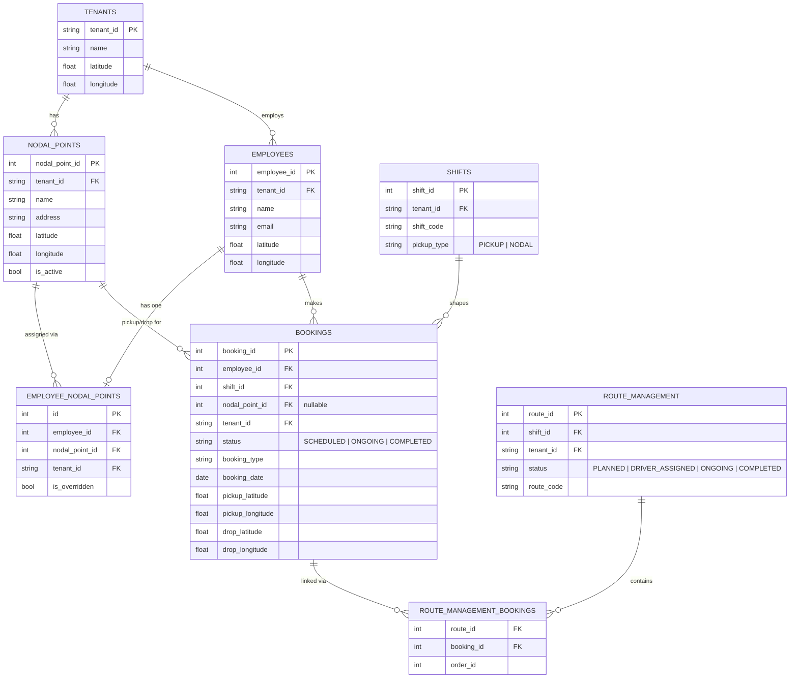
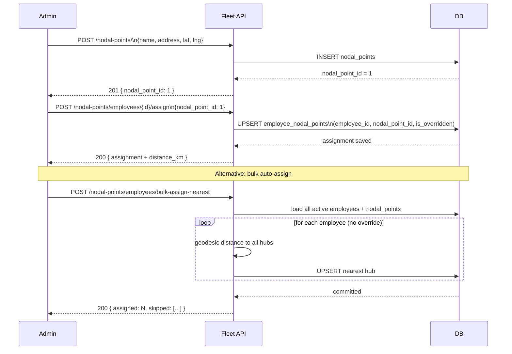
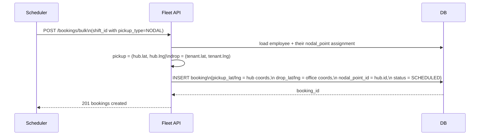
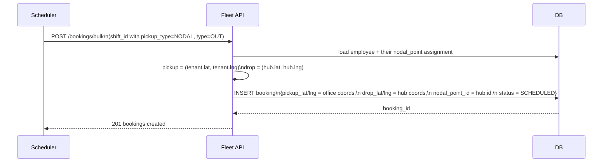
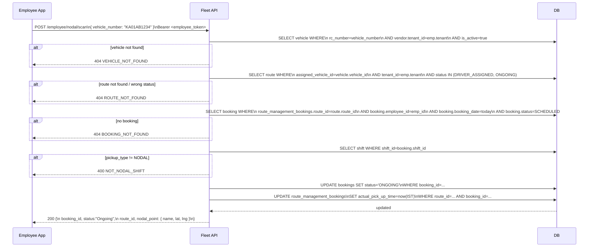
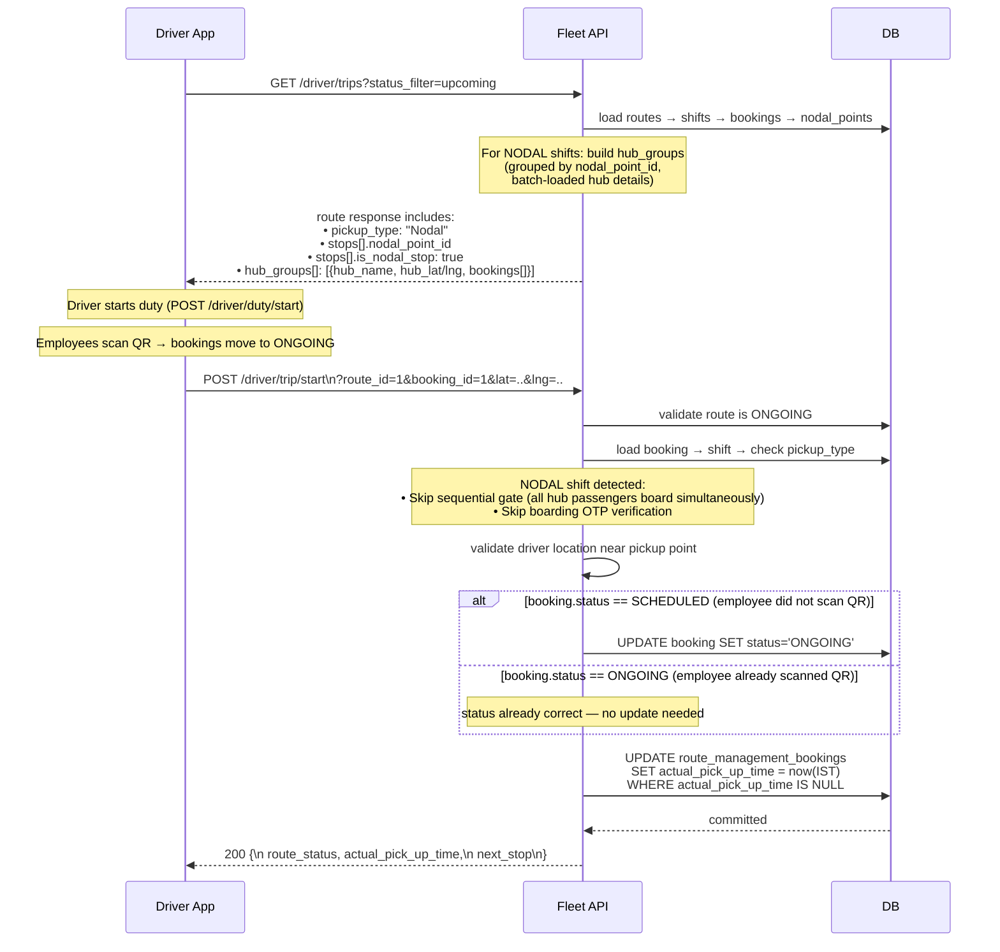

# Nodal Point Feature

A **nodal point** is a company-defined pickup / drop hub that employees travel to
instead of being collected at their home address. This is common when many employees
live in the same neighbourhood — a single vehicle stops at one hub rather than
door-stepping each person.

---

## Table of Contents

1. [Concept](#1-concept)
2. [Data Model](#2-data-model)
3. [Workflow Diagrams](#3-workflow-diagrams)
   - [Admin Setup Flow](#31-admin-setup-flow)
   - [Booking Flow (IN shift)](#32-booking-flow--in-shift)
   - [Booking Flow (OUT shift)](#33-booking-flow--out-shift)
   - [Employee QR Scan (Boarding)](#34-employee-qr-scan--boarding)
   - [Driver Flow (NODAL shifts)](#35-driver-flow--nodal-shifts)
4. [API Reference](#4-api-reference)
   - [Admin — Nodal Point CRUD](#41-admin--nodal-point-crud)
   - [Admin — Employee Assignment](#42-admin--employee-assignment)
   - [Employee App](#43-employee-app)
   - [Driver App](#44-driver-app)
5. [IAM Permissions](#5-iam-permissions)
6. [Error Codes](#6-error-codes)

---

## 1. Concept

```
Home addresses          Nodal Hub              Office
──────────────          ─────────              ──────
 Employee A ──┐
 Employee B ──┼──►  [ MG Road Hub ] ──────►  Tenant HQ
 Employee C ──┘          QR scan
                       marks boarding
```

- An admin defines one or more hubs per tenant (e.g. "MG Road Hub", "Whitefield Hub").
- Each employee is assigned to exactly one hub — either automatically (nearest hub by
  geodesic distance) or manually overridden by an admin.
- When a **NODAL shift** route is dispatched, the vehicle travels to the hub instead of
  individual addresses.
- The employee scans the vehicle's QR code on arrival; this marks their booking `ONGOING`.

### Key rules

| Rule | Detail |
|------|--------|
| One hub per employee | `employee_nodal_points` has a `UNIQUE` constraint on `employee_id` — upsert pattern on assign |
| Soft-delete only | Deactivating a hub (`is_active=False`) preserves historical assignments and bookings |
| Override flag | `is_overridden=True` means an admin manually picked the hub; `bulk-assign-nearest` skips these employees |
| Shift gate | QR scan is rejected if the booking's shift has `pickup_type != NODAL` |
| Route gate | QR scan is rejected if route status is not `DRIVER_ASSIGNED` or `ONGOING` |

---

## 2. Data Model

### Entity-Relationship Diagram



### Table summary

| Table | Purpose |
|-------|---------|
| `nodal_points` | Master list of hubs per tenant |
| `employee_nodal_points` | 1-to-1 assignment of employee → hub |
| `bookings.nodal_point_id` | FK capturing which hub was used for a booking |

---

## 3. Workflow Diagrams

### 3.1 Admin Setup Flow



### 3.2 Booking Flow — IN shift

An **IN** shift means the employee travels *from home → hub → office*.



### 3.3 Booking Flow — OUT shift

An **OUT** shift means the employee travels *from office → hub → home*.



### 3.4 Employee QR Scan — Boarding

Each vehicle has a **permanently pasted QR sticker** that encodes its `vehicle_number`
(the `rc_number` from the `vehicles` table). The employee scans it on arrival at the hub.

> **Why `vehicle_number` instead of `route_id`?** Physical QR stickers are permanent but
> `route_id` changes every day. Using `rc_number` ensures the QR never goes stale.



> **Gap 4 (implemented):** The QR scan also writes `actual_pick_up_time` (HH:MM in IST)
> to the `route_management_bookings` row. If the driver later calls `trip/start` for the
> same booking, the already-recorded time is preserved and not overwritten.

---

### 3.5 Driver Flow — NODAL shifts



**Key NODAL differences vs normal pickup:**

| Behaviour | Normal PICKUP | NODAL |
|-----------|--------------|-------|
| OTP verification | Required if `boarding_otp` set | **Skipped** |
| Sequential gate | Must complete stop N before N+1 | **Skipped** (hub passengers board simultaneously) |
| Accepts `ONGOING` booking | No (must be SCHEDULED) | **Yes** (QR-scanned already) |
| Preserves QR pick-up time | N/A | **Yes** (`actual_pick_up_time` not overwritten if already set) |

---

## 4. API Reference

All admin endpoints require a JWT from `POST /api/v1/auth/admin/login`.
All employee endpoints require a JWT from `POST /api/v1/auth/employee/login`.

**Admin endpoints** require `?tenant_id=<TENANT_CODE>` as a query parameter.
**Employee endpoints** derive `tenant_id` from the token automatically.

---

### 4.1 Admin — Nodal Point CRUD

#### Create a nodal point

```
POST /api/v1/nodal-points/
Authorization: Bearer <admin_token>
```

```json
{
  "tenant_id": "SAM001",
  "name": "MG Road Hub",
  "address": "MG Road, Bengaluru",
  "latitude": 12.9716,
  "longitude": 77.5946
}
```

**Response 201**

```json
{
  "success": true,
  "message": "Nodal point created successfully",
  "data": {
    "nodal_point_id": 1,
    "tenant_id": "SAM001",
    "name": "MG Road Hub",
    "address": "MG Road, Bengaluru",
    "latitude": 12.9716,
    "longitude": 77.5946,
    "is_active": true,
    "created_at": "2026-05-12T13:27:36.993627",
    "updated_at": "2026-05-12T13:27:36.993627"
  }
}
```

---

#### List nodal points

```
GET /api/v1/nodal-points/?tenant_id=SAM001[&is_active=true][&page=1][&per_page=20]
Authorization: Bearer <admin_token>
```

| Query param | Type | Default | Description |
|-------------|------|---------|-------------|
| `tenant_id` | string | required for admin | Tenant scope |
| `is_active` | bool | `null` (all) | Filter by active/inactive |
| `page` | int | 1 | Page number |
| `per_page` | int | 20 | Items per page (max 100) |

**Response 200**

```json
{
  "success": true,
  "data": [ { "nodal_point_id": 1, "name": "MG Road Hub", ... } ],
  "meta": { "total": 1, "page": 1, "per_page": 20, "total_pages": 1 }
}
```

---

#### Get nodal point by ID

```
GET /api/v1/nodal-points/{nodal_point_id}?tenant_id=SAM001
Authorization: Bearer <admin_token>
```

---

#### Update a nodal point (partial)

```
PUT /api/v1/nodal-points/{nodal_point_id}?tenant_id=SAM001
Authorization: Bearer <admin_token>
```

```json
{ "name": "MG Road Hub (West Gate)", "radius_meters": 250 }
```

Only the fields provided are changed.

---

#### Soft-delete (deactivate) a nodal point

```
DELETE /api/v1/nodal-points/{nodal_point_id}?tenant_id=SAM001
Authorization: Bearer <admin_token>
```

Sets `is_active=False`. Existing bookings and assignments are **preserved** for audit.

---

#### Nearest nodal points (sorted by distance)

```
GET /api/v1/nodal-points/nearest?tenant_id=SAM001&latitude=12.972&longitude=77.594[&limit=3]
Authorization: Bearer <admin_token>
```

| Query param | Type | Default | Description |
|-------------|------|---------|-------------|
| `latitude`  | float | required | Reference latitude |
| `longitude` | float | required | Reference longitude |
| `limit`     | int  | 3 | How many hubs to return (max 20) |

**Response 200**

```json
{
  "success": true,
  "data": [
    {
      "nodal_point_id": 1,
      "name": "MG Road Hub",
      "latitude": 12.9716,
      "longitude": 77.5946,
      "distance_km": 0.079
    },
    {
      "nodal_point_id": 2,
      "name": "Whitefield Hub",
      "latitude": 12.9698,
      "longitude": 77.75,
      "distance_km": 16.927
    }
  ]
}
```

---

### 4.2 Admin — Employee Assignment

#### Assign (or re-assign) a nodal point to an employee

```
POST /api/v1/nodal-points/employees/{employee_id}/assign?tenant_id=SAM001
Authorization: Bearer <admin_token>
```

```json
{
  "nodal_point_id": 1,
  "is_overridden": true
}
```

- `nodal_point_id` is **optional**. When omitted, the system auto-assigns the nearest
  active hub using the employee's stored coordinates.
- `is_overridden: true` protects this assignment from being overwritten by
  `bulk-assign-nearest`.

**Response 200**

```json
{
  "success": true,
  "data": {
    "id": 1,
    "employee_id": 5,
    "nodal_point_id": 1,
    "tenant_id": "SAM001",
    "is_overridden": true,
    "nodal_point": { "nodal_point_id": 1, "name": "MG Road Hub", ... },
    "distance_km": 7.257
  }
}
```

---

#### Get an employee's current assignment

```
GET /api/v1/nodal-points/employees/{employee_id}?tenant_id=SAM001
Authorization: Bearer <admin_token>
```

---

#### Remove an employee's assignment

```
DELETE /api/v1/nodal-points/employees/{employee_id}?tenant_id=SAM001
Authorization: Bearer <admin_token>
```

---

#### Bulk auto-assign nearest hub to all employees

```
POST /api/v1/nodal-points/employees/bulk-assign-nearest?tenant_id=SAM001
Authorization: Bearer <admin_token>
```

No request body needed.

**Behaviour:**

- Iterates over every **active** employee in the tenant.
- Skips employees whose assignment has `is_overridden=True`.
- Skips employees with no stored coordinates (reported in `skipped`).
- Upserts: updates existing auto-assignment, or creates a new one.

**Response 200**

```json
{
  "success": true,
  "message": "Bulk assignment complete: 12 employee(s) assigned",
  "data": {
    "assigned": 12,
    "skipped": [
      { "employee_id": 7, "reason": "no coordinates" }
    ]
  }
}
```

---

### 4.3 Employee App

#### Get my assigned nodal point

```
GET /api/v1/employee/nodal/assignment
Authorization: Bearer <employee_token>
```

Returns the hub the current employee is assigned to — used by the mobile app to
display the correct map pin.

**Response 200**

```json
{
  "success": true,
  "data": {
    "nodal_point_id": 1,
    "name": "MG Road Hub",
    "address": "MG Road, Bengaluru",
    "latitude": 12.9716,
    "longitude": 77.5946,
    "is_overridden": false
  }
}
```

**Error 404 — no assignment yet**

```json
{
  "detail": {
    "error_code": "ASSIGNMENT_NOT_FOUND",
    "message": "No nodal point assigned to you yet. Please contact your admin."
  }
}
```

---

#### QR scan — board at nodal point

```
POST /api/v1/employee/nodal/scan
Authorization: Bearer <employee_token>
```

```json
{ "vehicle_number": "KA01AB1234" }
```

The vehicle has a **permanently pasted QR sticker** encoding its `vehicle_number` (the
`rc_number` from the `vehicles` table). The employee scans it on arrival at the hub.
The API resolves the vehicle → today's active route → employee booking, then marks the
booking `ONGOING` and records the pick-up time.

**Response 200**

```json
{
  "success": true,
  "message": "Nodal onboarding successful",
  "data": {
    "booking_id": 101,
    "status": "Ongoing",
    "route_id": 42,
    "nodal_point": {
      "nodal_point_id": 1,
      "name": "MG Road Hub",
      "address": "MG Road, Bengaluru",
      "latitude": 12.9716,
      "longitude": 77.5946
    },
    "message": "You have been marked as onboarded at the nodal point."
  }
}
```

---

### 4.4 Driver App

All driver endpoints require a JWT obtained via the two-step device flow:

```
POST /api/v1/auth/driver/device/verify   → returns vendor list
POST /api/v1/auth/driver/select-tenant   → returns access_token
```

---

#### Get upcoming / ongoing trips (NODAL-enriched)

```
GET /api/v1/driver/trips?status_filter=upcoming&booking_date=2026-05-12
Authorization: Bearer <driver_token>
```

For NODAL shifts the response includes three extra fields vs normal shifts:

| Field | Location | Description |
|-------|----------|-------------|
| `pickup_type` | route object | `"Nodal"` for NODAL shifts |
| `nodal_point_id` | each stop | Hub ID this passenger belongs to |
| `is_nodal_stop` | each stop | `true` when `nodal_point_id` is set |
| `hub_groups` | route object | Array of hub summaries with passenger lists |

**`hub_groups` structure:**

```json
"hub_groups": [
  {
    "nodal_point_id": 1,
    "hub_name": "MG Road Hub",
    "hub_address": "MG Road, Bengaluru",
    "hub_latitude": 12.9716,
    "hub_longitude": 77.5946,
    "passenger_count": 3,
    "boarded_count": 2,
    "pending_count": 1,
    "bookings": [
      {
        "booking_id": 101,
        "employee_id": 5,
        "employee_name": "Alice",
        "employee_phone": "9000000001",
        "status": "Ongoing",
        "order_id": 1,
        "is_boarding_otp_required": false,
        "is_boarded": true
      }
    ]
  }
]
```

`hub_groups` is `null` for non-NODAL routes.

---

#### Start trip / board passenger (NODAL)

```
POST /api/v1/driver/trip/start?route_id=1&booking_id=101&current_latitude=12.9716&current_longitude=77.5946
Authorization: Bearer <driver_token>
```

Optional query param: `otp` (ignored for NODAL shifts).

**NODAL-specific behaviour:**
- `booking.status` may be `SCHEDULED` (driver manually boards) or `ONGOING` (employee
  already scanned QR). Both are accepted.
- OTP verification is **skipped**.
- The sequential gate (must complete earlier stops first) is **skipped** — all hub
  passengers board simultaneously.
- `actual_pick_up_time` is recorded only if not already set by the employee QR scan.

**Response 200**

```json
{
  "success": true,
  "message": "Trip started successfully",
  "data": {
    "route_id": 1,
    "route_status": "Ongoing",
    "started_at": "20:08",
    "current_booking_id": 101,
    "current_status": "Ongoing",
    "actual_pick_up_time": "20:08",
    "next_stop": null
  }
}
```

**Error 400 — non-boardable status**

```json
{
  "detail": {
    "error_code": "BOOKING_NOT_BOARDABLE",
    "message": "Booking is not in a boardable state for nodal confirmation",
    "details": { "current_status": "COMPLETED" }
  }
}
```

---

## 5. IAM Permissions

The `nodal_point` module is seeded automatically via `seed_iam()`. All roles that
inherit `NodalPointPolicy` get the listed actions.

| Permission | Action | Assigned to |
|------------|--------|-------------|
| `nodal_point.create` | Create hubs | SuperAdmin, Admin |
| `nodal_point.read`   | List / get hubs | SuperAdmin, Admin |
| `nodal_point.update` | Edit hub, assign/bulk-assign employees | SuperAdmin, Admin |
| `nodal_point.delete` | Soft-delete hub | SuperAdmin, Admin |

Employee app endpoints (`/employee/nodal/*`) use `EmployeeAuth` — no IAM module check,
only a valid employee JWT is required.

---

## 6. Error Codes

| `error_code` | HTTP | Meaning |
|--------------|------|---------|
| `TENANT_ID_REQUIRED` | 400 | Admin did not provide `?tenant_id=` |
| `NODAL_POINT_NOT_FOUND` | 404 | Hub ID not found in tenant |
| `EMPLOYEE_NOT_FOUND` | 404 | Employee not found or inactive |
| `EMPLOYEE_NO_COORDINATES` | 400 | Auto-assign requested but employee has no `latitude`/`longitude` |
| `NO_NODAL_POINTS` | 400 | Tenant has no active hubs — cannot auto-assign |
| `ASSIGNMENT_NOT_FOUND` | 404 | Employee has no hub assignment |
| `ROUTE_NOT_FOUND` | 404 | QR scan: no active route for vehicle, or wrong tenant |
| `VEHICLE_NOT_FOUND` | 404 | QR scan: `vehicle_number` not found or not in tenant |
| `BOOKING_NOT_FOUND` | 404 | QR scan: no SCHEDULED booking for employee on this route today |
| `NOT_NODAL_SHIFT` | 400 | QR scan: booking's shift `pickup_type` is not `NODAL` |
| `BOOKING_NOT_BOARDABLE` | 400 | Driver `trip/start`: booking status is not `SCHEDULED` or `ONGOING` (e.g. already `COMPLETED`) |
